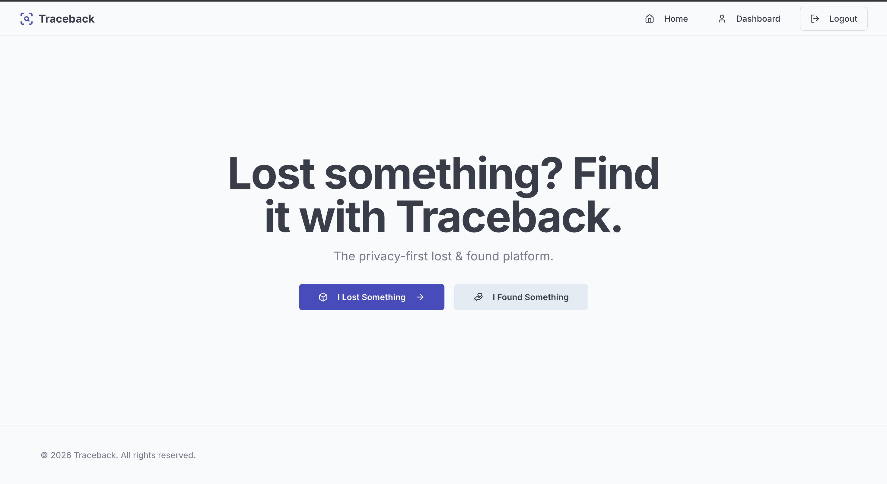
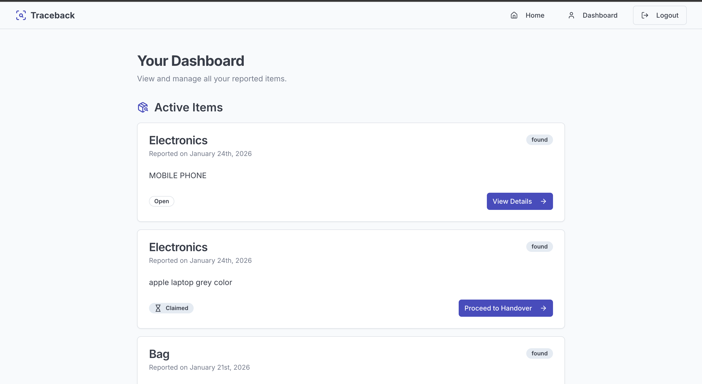
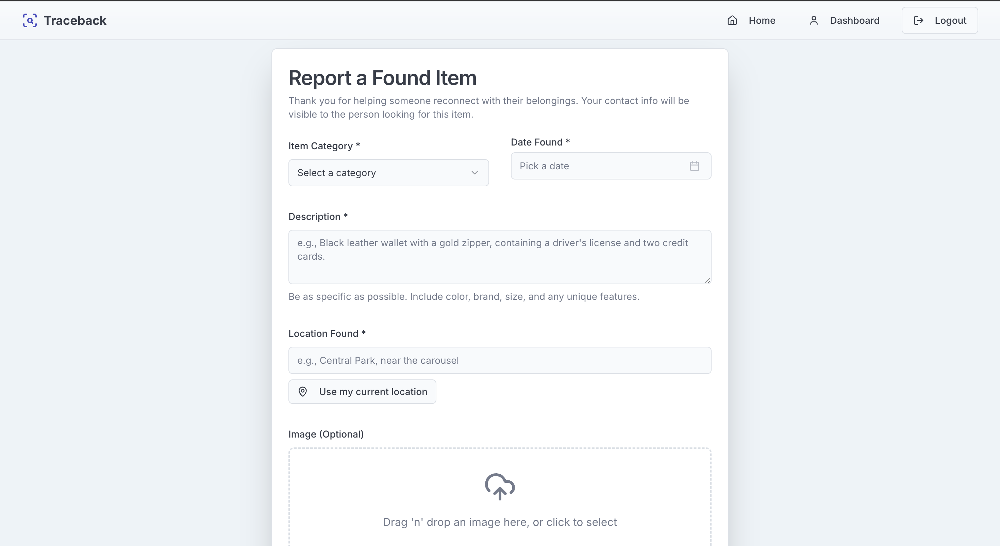
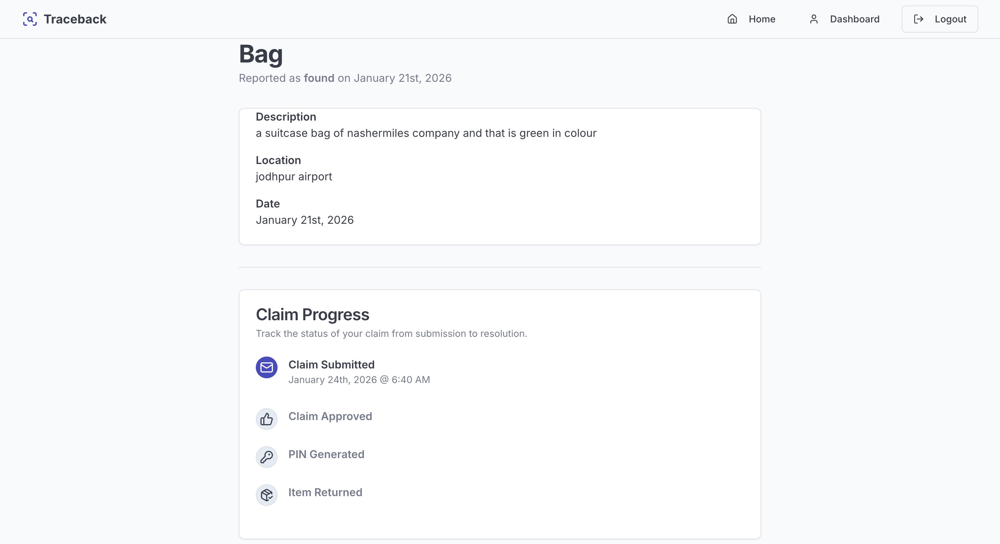

# Traceback – Lost & Found Web Application

Traceback is a full-stack web application that helps users report, track, and recover lost items through a structured and secure workflow.

The project focuses on building real-world features such as authentication, data security, controlled handover flows, and dashboard-based user interaction using modern web technologies.

⸻
## 📸 Screenshots

### Home

### Dashboard

### Report Found Item

### Item Details

---
## 🧠 Problem Statement

Recovering lost belongings is often difficult due to:
	•	Lack of structured reporting systems
	•	Privacy concerns when sharing personal contact details
	•	Unclear verification during item handover
	•	No centralized way to track claim progress

Traceback aims to address these issues with a secure, user-friendly web solution.

⸻

💡 Solution Overview

Traceback provides a controlled lost–found workflow where:
	•	Users can report lost or found items
	•	Potential matches are suggested to reduce manual searching
	•	Ownership verification and handover are handled securely
	•	Sensitive information is shared only when required

The system is designed to prioritize clarity, privacy, and usability.

⸻

✨ Core Features

🔐 Authentication & User Access
	•	Secure user authentication using Firebase Authentication
	•	Centralized user dashboard for managing reports and claims

📁 Lost & Found Reporting
	•	Separate flows for reporting lost and found items
	•	Optional image uploads to improve identification
	•	Structured data storage using Firestore

🤖 AI-Assisted Matching (Prototype)
	•	AI-assisted logic is used to experiment with matching lost and found items
	•	Matching is based on item descriptions, categories, and optional images
	•	Implemented as a prototype to explore how AI can support discovery workflows

🧾 Ownership Verification & Secure Handover
	•	AI-assisted question generation to support ownership verification
	•	Claim review flow with approval or rejection by the finder
	•	One-time 6-digit PIN generated for secure physical handover
	•	Contact details shared only after claim approval

📊 Claim Lifecycle Management
	•	Clear state-based claim flow: pending → approved → closed
	•	Strict Firestore security rules enforce valid transitions
	•	Full claim history visible in the user dashboard

⸻

🛠️ Tech Stack
	•	Framework: Next.js (App Router)
	•	Frontend: React, TypeScript
	•	Styling: Tailwind CSS, shadcn/ui
	•	Backend & Database: Firebase (Authentication, Firestore, Storage)
	•	AI Tooling (Experimental): Google Genkit
	•	Validation: React Hook Form & Zod
	•	Deployment: Firebase Hosting / Vercel

⸻

🌐 Live Demo

🔗 Firebase Hosted App: https://studio--studio-5844244304-a603d.us-central1.hosted.app
🔗 GitHub Repository: https://github.com/khatribhavesh05/Traceback

⸻

⚙️ Getting Started

Prerequisites
	•	Node.js (v18 or later)
	•	Firebase project

Setup

git clone https://github.com/khatribhavesh05/Traceback.git
cd Traceback
npm install

Create a .env file in the root directory:

NEXT_PUBLIC_FIREBASE_API_KEY=your_key
NEXT_PUBLIC_FIREBASE_AUTH_DOMAIN=your_domain
NEXT_PUBLIC_FIREBASE_PROJECT_ID=your_project_id
NEXT_PUBLIC_FIREBASE_STORAGE_BUCKET=your_bucket
NEXT_PUBLIC_FIREBASE_MESSAGING_SENDER_ID=your_sender_id
NEXT_PUBLIC_FIREBASE_APP_ID=your_app_id

# AI tooling (experimental)
GEMINI_API_KEY=your_api_key

Run the application:

npm run dev

Open http://localhost:3000

⸻

🔄 Claim Workflow Summary
	1.	User submits a lost item claim
	2.	Finder reviews and approves or rejects the claim
	3.	On approval, a secure handover PIN is generated
	4.	PIN is verified during physical handover
	5.	Claim is closed and recorded

This flow is enforced using Firestore security rules.

⸻

📌 Project Note

This project is a functional prototype built to explore full-stack development, authentication, database security rules, and structured workflows.

AI-assisted features are implemented for learning and experimentation purposes and are not intended to represent a production-grade AI system.
